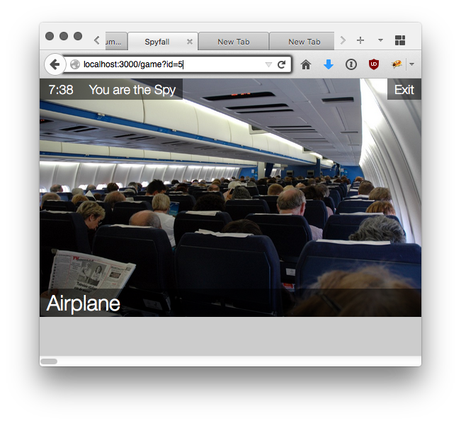
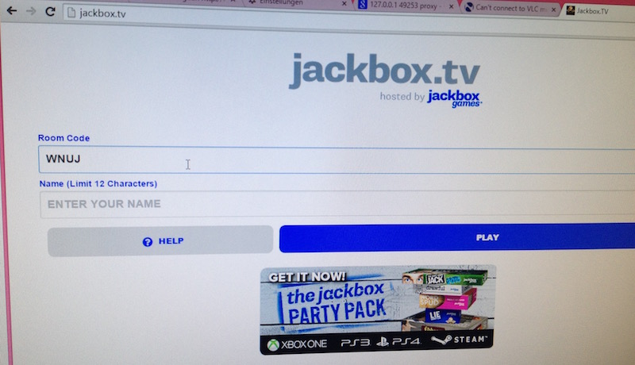

# Spyfall
The Card Game Spyfall implemented with images. Backend is written in go as exercise.




## Run
I am using fswatch to restart the server when the code changes.
```
brew install fswatch
fswatch-run *.go ./server.sh 
```

## Todo
- [ ]  Free memory: remove old rooms based on the timestamp
- [ ]  Add different themes (maybe archer, james bond, original)
- [ ]  Error Messages: notify user what went wrong, maybe little info box
- [ ]  Test concurrency: write a http test and hammer into the server, i think there is a bug
- [ ]  add godoc

## Maybe Features
* let the user set the countdown time
* understand the template functions better
* add roles
* notify when player leaves lobby or game

## TIL
* iOS 9 body element will always resize it self cant use overflow, it requires a wrapper with overflow
* iOS 9 requires `overflow-x: scroll;-webkit-overflow-scrolling: touch; ` for fluid scrolling
* backdrop filter does not seem to work with figure: http://iamvdo.me/en/blog/advanced-css-filters

## Inspired
Inspired by the best party game on the PC [Jackbox Party Pack](http://jackboxgames.com/project/jbpp/).

